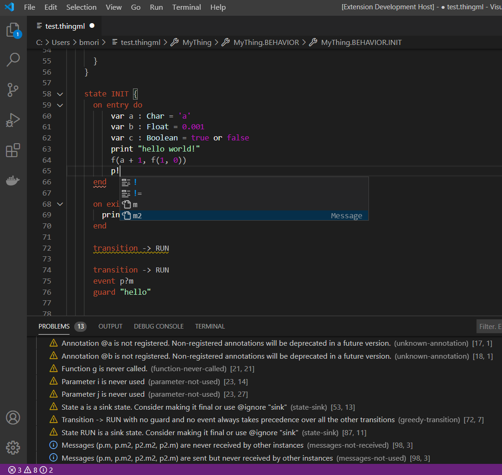

> You need Java installed, sorry!

# Building `.vsix`

1. `cd <ThingML> && mvn clean install && cd language && mvn clean install`
2. `cp ./thingml-ide/target/thingml.ide-2.0.0-SNAPSHOT-ls.jar <thingml-vscode>/server/./thingml-ide/target/thingml.ide-2.0.0-SNAPSHOT-ls.jar`
3. `npm i -g vsce` (only needed once, installed globally)
4. `vsce package`
5. `code --install-extension thingml-vscode-0.0.1.vsix` (or use VS Code GUI to install extension from `.vsix` file)
